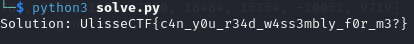

# Password Checker

|         |                          |
| ------- | ------------------------ |
| Authors | Giacomo Boschi <@Giak78> |
| Points  | 500                      |
| Tags    | rev                      |

## Challenge Description

My friend asked me to build a password checker, but I hate web technologies.

Guess what? I'll use C :D

Website: [http://pchecker.challs.ulisse.ovh:5337](http://pchecker.challs.ulisse.ovh:5337)

## Summary

The challenge is a basic flag checker.

## Analysis

If we inspect with a web browser inspector the website,we see that javascript is calling a web assembly module.

```js
function checkGuess() {
  const userGuess = document.getElementById("guess").value;
  const result = document.getElementById("result");

  var correct = Module.ccall(
    "password_check",
    "number",
    ["string"],
    [userGuess],
  );

  if (correct) {
    result.textContent = "Correct! You found my password!";
    result.style.color = "green";
  } else {
    result.textContent = "Wrong guess. Try again!";
    result.style.color = "red";
  }
}
```

If we use wasm2wat or wasm2c we can analize the "password_check".
It is pretty long regardless of what we use,but it can be broken down to this:

- The program calls a check function (check_0,check_1... and so on).
- If even the function returns 0, it jumps to a certain label (Basically as soon as a check fails, it means wrong flag)
- Otherwise, it goes to the next check.

Here's an example with wasm2c

```C
/*An example*/
  var_B3:; /*check number 3*/
  var_i0 = var_l3;
  var_i0 = i32_load(&instance->w2c_memory, (u64)(var_i0) + 8u);
  var_l13 = var_i0;
  var_i0 = var_l13;
  var_i0 = w2c__check3_0(instance, var_i0);/*call check3*/
  var_l14 = var_i0;
  var_i0 = var_l14;
  if (var_i0) {goto var_B4;} /*return value equals 1--> success,go to check4*/
  var_i0 = 0u; /*Failure,go to fail label*/
  var_l15 = var_i0;
  var_i0 = var_l3;
  var_i1 = var_l15;
  i32_store(&instance->w2c_memory, (u64)(var_i0) + 12, var_i1);
  goto var_B0;
```

There are many checks, let's start with the first one.
Aside the chaos that is wasm,the core part is this one:

```C
  var_i0 = w2c__f21(instance, var_i0); //weird function
  var_l5 = var_i0;
  var_i0 = 41u; //expected value
  var_l6 = var_i0;
  var_i0 = var_l5;
  var_l7 = var_i0;
  var_i0 = var_l6;
  var_l8 = var_i0;
  var_i0 = var_l7;
  var_i1 = var_l8;
  var_i0 = var_i0 == var_i1; //check expected value
```

If we look at w2c\_\_f21:

```C
  var_L2:
    var_i0 = var_l1;
    var_i0 = i32_load8_u(&instance->w2c_memory, (u64)(var_i0));
    var_i0 = !(var_i0);
    if (var_i0) {goto var_B0;} //character is null--> terminate
    var_i0 = var_l1;
    var_i1 = 1u; //increase counter
    var_i0 += var_i1;
    var_l1 = var_i0;
    var_i1 = 3u;
    var_i0 &= var_i1;
    if (var_i0) {goto var_L2;}
```

we can see it is counting how many values are different from 0 in a contiguos memory region.
Given the context of the challenge,it is pretty safe to assume that we are checking the lenght of the flag.

So the first check controls the lenght,what about the othes?
If we give a look at check_one,a repeating pattern arises:

```C
var_i0 = i32_load(&instance->w2c_memory, (u64)(var_i0) + 12u);
  var_l27 = var_i0;
  var_i0 = var_l27;
  var_i0 = i32_load8_u(&instance->w2c_memory, (u64)(var_i0) + 29u); //load flag at 29
  var_l28 = var_i0;
  var_i0 = 24u;
  var_l29 = var_i0;
  var_i0 = var_l28;
  var_i1 = var_l29;
  var_i0 <<= (var_i1 & 31); //weird wasm memory mask
  var_l30 = var_i0;
  var_i0 = var_l30;
  var_i1 = var_l29;
  var_i0 = (u32)((s32)var_i0 >> (var_i1 & 31));//weird wasm memory mask ends
  var_l31 = var_i0;
  var_i0 = 6u;
  var_l32 = var_i0;
  var_i0 = var_l31;
  var_i1 = var_l32;
  var_i0 *= var_i1; //multiply characther with value
  var_l33 = var_i0;
  var_i0 = var_l26;
  var_i1 = var_l33;
  var_i0 += var_i1; //sum result
```

can be broke down to

```C
flag_charachter = flag[29];
multiplier = 6;
result = flag_charachter*multiplier;
counter += result;
```

If we keep looking at the code we can see this pattern repeating, with very few differences:

- Sometimes in a block we do not see the multiplication,but a bitwise operator,since the rest of the block is basically the same, we can safely
  assume that wasm is just optimizing power of 2 multiplication.
- Sometimes the number multiplied is really huge: we can verify with any debugger that it is just a rappresentation for negatives.

We arrive at the end of check1 with:

```c
    var_i0 = i32_load8_u(&instance->w2c_memory, (u64)(var_i0) + 1u); /*flag[1]*/
  var_l324 = var_i0;
  var_i0 = 24u;
  var_l325 = var_i0;
  var_i0 = var_l324;
  var_i1 = var_l325;
  var_i0 <<= (var_i1 & 31);
  var_l326 = var_i0;
  var_i0 = var_l326;
  var_i1 = var_l325;
  var_i0 = (u32)((s32)var_i0 >> (var_i1 & 31));
  var_l327 = var_i0;
  var_i0 = 34u;
  var_l328 = var_i0;
  var_i0 = var_l327;
  var_i1 = var_l328;
  var_i0 *= var_i1;
  var_l329 = var_i0;
  var_i0 = var_l322;
  var_i1 = var_l329;
  var_i0 += var_i1; //+=flag[1]*34
  var_l330 = var_i0;
  var_i0 = 4294952007u;//-15289
  var_l331 = var_i0;
  var_i0 = var_l330;
  var_l332 = var_i0;
  var_i0 = var_l331;
  var_l333 = var_i0;
  var_i0 = var_l332;
  var_i1 = var_l333;
  var_i0 = var_i0 == var_i1; // check equality
  var_l334 = var_i0;
  var_i0 = 1u;
  var_l335 = var_i0;
  var_i0 = var_l334;
  var_i1 = var_l335;
  var_i0 &= var_i1;
  var_l336 = var_i0;
  var_i0 = var_l336;
  goto var_Bfunc;
  var_Bfunc:;
  FUNC_EPILOGUE;
  return var_i0; //return 1 if check goes well
```

So we basically have a linear combination of the flag charachters that must match a value.

What about the other checks?
Let's look at at the other checks... we can observe the same pattern with check1!
Some checks (even check1 actually) have an additional operation though.

```c
  /*in most of the checks:*/
  var_i0 = 4294938209u; /*value to match*/
  var_l331 = var_i0;
  var_i0 = var_l330;
  var_l332 = var_i0;
  var_i0 = var_l331;
  var_l333 = var_i0;
  var_i0 = var_l332;
  var_i1 = var_l333;
  var_i0 = var_i0 == var_i1;/*check equivalence*/
  var_l334 = var_i0;
  var_i0 = 0u;
  var_l335 = var_i0;
  var_i0 = 1u;
  var_l336 = var_i0;
  var_i0 = var_l334;
  var_i1 = var_l336;
  var_i0 &= var_i1; /*and the result with already existing variable*/
  var_l337 = var_i0;
  var_i0 = var_l335;
  var_l338 = var_i0;
  var_i0 = var_l337;
  var_i0 = !(var_i0); /*if check fails go to end function and return failure */
  if (var_i0) {goto var_B0;}
  var_i0 = var_l3;
  var_i0 = i32_load(&instance->w2c_memory, (u64)(var_i0) + 12u); /*otherwise new combination starts*/
  var_l339 = var_i0;
  var_i0 = var_l339;
  var_i0 = i32_load8_u(&instance->w2c_memory, (u64)(var_i0) + 33u);
```

This means that some functions have multiple linear combinations to check!
If we count the checks,there is a total equal to the lenght of the flag: we have a linear system to solve!

#Solution
To get all the equations,we can use the fact that the flag character are obtained with **i32_load8_u**,which is not used in other parts of the code (excpet 3 lines that are at the start and end).
After we read all the linear equations,we can use python z3 library to solve the system and find the flag

```python
from z3 import *

lines = []
with open ("disassembly.c","r") as f:
    lines = f.readlines()

i = 0
index_lines = []
multipliers = []
results = []

for line in lines:
    if "i32_load8_u" in line:
        index_lines.append(line)
        if "*" in lines[i+16]: #normal multiplication
            multipliers.append(lines[i+12])
        else:
            multipliers.append("POW|"+lines[i+12]) #power of 2
    i+=1

#the first line is the function definition and the last 2 lines are used for the lenght of the flag
index_lines = index_lines[1:-2]
multipliers = multipliers[1:-2]

#get the results
i = 0
for line in lines:
    if "var_i0 = var_i0 == var_i1;" in line:
        results.append(lines[i-8]) #always 8 lines up this check
    i+=1


#first one is for check0,last 2 are for another function
results = results[1:-2]

#A single equation is an array of tuples (multiplier,index)
equations = []
for i in  range(41):
    equations.append([])
    for z in range(41):
        number = -1
        if "+" in index_lines[i*41+z]:
            number = index_lines[i*41+z].split('+')[1][:-4] # remove u)\n;
            number = int(number)
        else:
            number = 0

        multiplier = multipliers[i*41+z].split('=')[1][1:-3]
        multiplier = int(multiplier)

        if "POW|" in multipliers[i*41+z]: #powers of 2
            multiplier=2**(multiplier)

        if multiplier > 2**31-1: #negative numbers
            multiplier-=4294967296
        equations[i].append((multiplier,number))


#get right side
right_side = []
for r in results:
    number = r.split('=')[1][1:-3]
    number = int(number)
    if number > 2**31-1:
        number-=4294967296
    right_side.append(number)


#solve with z3 :)
solver = Solver()

x = [Real(f"x{i}") for i in range(41)]

for eq, rhs in zip(equations, right_side):
    equation = Sum([z * x[j] for z, j in eq])  # Correct multiplication
    solver.add(equation == rhs)

if  solver.check() == sat:
    model = solver.model()
    solution = [model[x[i]] for i in range(41)]
    solution = ''.join(chr(int(val.as_string())) for val in solution)
    print("Solution:", solution)
else:
    print("No solution found.")

```



(Side note: the values showed in this writeup might differ from your wasm file because of how it was generated,but the script and concepts are the same)
